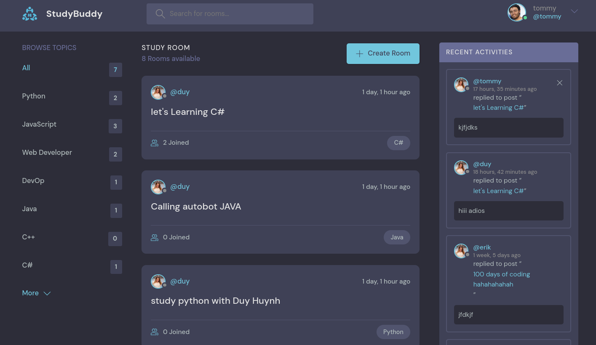

# Django Chat Room

This Django project provides a real-time chat room experience where users can:

* **Log in and out:** Securely authenticate users before allowing them to enter chat rooms.
* **Create and manage chat rooms:** Authorized users can create new chat rooms with custom topics.
* **Join and chat in rooms:** Users can join existing rooms and send messages to other participants.
* **Manage profiles:** Users can view and potentially update their profile information (depending on your implementation).

**Features:**

* **Database Management:** Utilizes a relational database (such as PostgreSQL or MySQL) to store user data, chat messages, rooms, and topics.
* **Authentication:** Employs a Django authentication system for user login and access control.
* **Real-time Communication:** Considers using WebSockets (e.g., Django Channels) for real-time chat updates, enhancing the user experience.

**Piture:**

**Installation:**

1. **Prerequisites:** Ensure you have Python (version 3.x recommended) and pip (the package installer) installed on your system.
2. **Clone the Repository:** Use Git to clone this project's repository locally.
3. **Create a Virtual Environment:** It's highly recommended to create a virtual environment to isolate project dependencies. You can use tools like `venv` or `virtualenv`.
4. **Activate the Virtual Environment:** Activate the virtual environment you created.
5. **Install Dependencies:** Run `pip install -r requirements.txt` to install the required Python packages listed in the `requirements.txt` file.
6. **Database Setup:** Follow the instructions for your chosen database (e.g., create a database and configure Django settings).
7. **Database Migrations:** Run `python manage.py migrate` to apply database migrations (creating tables and structures).
8. **Development Server:** Start the development server using `python manage.py runserver`. This typically runs at `http://127.0.0.1:8000/` by default.
